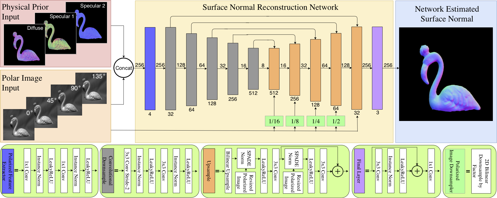

# **Deep Shape from Polarization**

## **News**
- [2020/08] Our paper got accepted to ECCV 2O20! [Main](https://www.ecva.net/papers/eccv_2020/papers_ECCV/papers/123690545.pdf) | [Supplement](https://visual.ee.ucla.edu/assets/deepsfp_eccv_supp.pdf) | [Journal](https://link.springer.com/chapter/10.1007%2F978-3-030-58586-0_33?fbclid=IwAR3B7VM-sXnEFGMGQRGu8G_CC1hBGXmPiael9fnnGLzkTGmET8h8q-XGKzU)
- [2020/08] Our [website](https://visual.ee.ucla.edu/deepsfp.htm/) is now live!

## **Introduction**
This is the official code of [Deep Shape from Polarization](https://arxiv.org/abs/1903.10210).
We make a first attempt to bring the Shape from Polarization (SfP) problem to the realm of deep learning. Our approach combines various unique deep-learning techniques with a physics-inspired approach to combining priors calculated by more traditional methods. We also introduce a challenging surface-normals dataset for future learning-based approaches to SfP. Our method achieves SoTA for the SfP problem, and we hope will pave the way for future exploration into this fascinating problem, especially in the context of deep learning.




## **Quick start**
### **Install**
1. Install PyTorch=1.1.0 following the [official instructions](https://pytorch.org/)
2. Clone repo:
````bash
git clone https://github.com/alexrgilbert/deepsfp.git $SfP_ROOT && cd deepsfp
````
3. Install required libraries:
````bash
pip install --user -r requirements.txt
````

### **Data Preparation**
Our dataset can be found here: [SfP Dataset](https://drive.google.com/file/d/1-CYRwU9Uwry7XgcEWhwX2P8nIJtOKKZZ/view?usp=sharing). Unzipping the downloaded file will produce a directory (`DeepSfPData`) with several files and subdirectories. Copy the contents of that folder to the `$SfP_ROOT/data` directory in this repo. Note, the `$SfP_ROOT/data/README.md`, `$SfP_ROOT/data/surface_normals/(train|test|test_supp)_split.csv` files are identical to those downloaded with the dataset, and can be overwritten when copying. Before using this data for our method however, several additional processing steps must be performed.

&emsp;***Fully-Prepared Data:***  We provide a fully prepared version of the dataset [here](https://drive.google.com/file/d/1-0F1NDkiKohA8yYk2qyX_L2xkhMbqWw3/view?usp=sharing). This data is ready for training/inference with the `$SfP_ROOT/experiments/deepsfp.yaml` config (i.e. the configuration used for our ECCV submission). If using this data along with our configuration, the following steps can be skipped. However, if making changes to the dataset or the RandomCrop augmentation parameters, the corresponding steps must be repeated as noted below.

#### **Prior Generation**

First, 'priors' must be generated for each object in the dataset. These are the surface normals which satisfy the classical SfP equations. The motivation and theory behind these solutions are explained thouroughly in the [main paper](https://www.ecva.net/papers/eccv_2020/papers_ECCV/papers/123690545.pdf), as well as the [supplement](https://visual.ee.ucla.edu/assets/deepsfp_eccv_supp.pdf). More details about adding these priors to the existing files in the dataset can be found in the `$SfP_ROOT/data/README.md` (or in the README included with the dataset).

#### **Apply Static Transforms**

Before running an experiment using a given config and dataset, all the data must be converted to the format expected by our dataloader (from that of the downloaded dataset) before training. Note, these conversion operations could be performed as transforms during loading, but we run them offline to accelerate training. The steps are as follows:

- Extend dimensions to HxWxC
- Apply binary foreground mask (indicating pixels belonging to object)
- Remove redundant padding along W dimension
- Transpose axes to CxHxW
- Set precision (we use 32-bit floating point)
- Convert from numpy array to PyTorch tensor

*After* completeing the previous two steps (i.e. moving downloaded data and adding priors), these conversion can be performed for a given experiment configuration using the following command:

````bash
python $SfP_ROOT/tools/mat_to_pth.py [-c $SfP_ROOT/experiments/<config_name>.yaml] [--overwrite] [Additional configuration overrides...]
````
The experiment configuration file (see *Experiment Configuration* section below) contains several relevant fields to this command. The `data_cfg` sub-config for each phase is `cfg.(train|test).dataloader.dataset`. Within this sub-config, the relevant fields are:

- `data_cfg.root` & `data_cfg.name`: Dataset location (i.e. `os.path.join(root, name)`).
- `data_cfg.data_list`: List of file names for train or test set.
- `data_cfg.precision`: Precision (default = `float32`) of tensors holding sample data (Note, mask will be saved as `uint8` regardless of this field).

Specifically, for any object file found in the train/test lists for a given dataset in the specified location, conversions must be performed for the given precision level before that experiment can be run. Therefore, this step must be repeated for any adjustment to these fields (i.e. a new dataset or a new precision). Note, if the `overwrite` flag isn't provided to the conversion script mentioned above, the script will automatically no-op for any previously converted data items.

Running `mat_to_pth.py` generates an experiment output folder located at: `$SfP_ROOT/<$cfg.output_dir>/<$data_cfg.name>/<$EXPERIMENT_ID>`, (where `EXPERIMENT_ID=<$CONFIG_FILENAME>_<$TIME_STRING>_(train|test)-set-mat-to-pth`). Inside will be the following files containing metadata for reproducing:

- Frozen Config (`<$EXPERIMENT_ID>.yaml`): YAML configuration override file with the exact configuration used for this conversion run.
- Frozen Train/Test Split (`(train|test)_set.csv`): Copy of the training & test set files (specified by `<$data_cfg.root>/<$data_cfg.name>/<$data_cfg.data_list>`).
- Log file (`<$EXPERIMENT_ID>.log`): Includes a printout of the current commit hash for this repo, the experiment config, and logging messages from the process.

#### **Generate 'Crop Indices'**

In our proposed approach, we train on random crop's of each object's polarazation images (as a form of data augmentation), using only crops containing a sufficient number of foreground (i.e. object) pixels. We find however, that finding such valid crops during data loading slows down training. Accordingly, for a given config and dataset, we generate the crop indices (i.e. of included pixels) for all potential valid crops (i.e. crops of the configured size with foreground-pixel ratio exceeding the configured threshold) offline before training. During training, we can then simply randomly sample from these crop indices and create a cropped view of the tensor with the result. *After* completing the previous 3 steps (including static transformations), crops can be generated with the following command for a given experiment configuration using the following command:

````bash
python $SfP_ROOT/tools/generate_crop_masks.py [-c $SfP_ROOT/experiments/<config_name>.yaml] [--overwrite] [Additional configuration overrides...]
````

Similar to conversion step explained above, the experiment configuration file contains several relevant fields to this command within the `data_cfg` subconfig (i.e. `cfg.(train|test).dataloader.dataset`):

- `data_cfg.data_list`: List of file names for train or test set.
- `data_cfg.trasnforms`: YACS CfgNode (which behaves like a dictionary). Each key is the name of a data transform class which will be applied to each data sample during loading. The corresponding value is a CfgNode containing the key-word args dictionary used to initialize the transfrom instance. For crop generation, only the `RandomCrop` key will be processed. Note, if this CfgNode doesn't contain `RandomCrop`, no crop-generation will be run for the given phase.
- `data_cfg.trasforms.RandomCrop.crop_size`: Dimensions (H,W) of crop, in pixels.
- `data_cfg.trasforms.RandomCrop.foreground_ratio_threshold`: Minimum threshold on foreground-pixel ratio for a valid crop.
- `data_cfg.trasforms.RandomCrop.dataset_dir`: Dataset location (should be equivalent to `os.path.join(data_cfg.root, data_cfg.name)`).

Specifically, for any object file found in the train/test lists for a given dataset in the specified location, crop indices must be generated for the configured combination of crop dimenstions/foreground threshold- before that experiment can be run (if the RandomCrop transform is desired during training/testing). Therefore, this step must be repeated for any adjustment to these fields (i.e. a new dataset or a new crop parameter combination). Note, if the `overwrite` flag isn't provided to the crop generation script mentioned above, the script will automatically no-op for any crop indices which have previously been generated. Of course, if `RandomCrop` isn't contained in the transform list, this entire step can be ignored.

The same outputs as described above are created after running `generate_crop_masks.py`, but the experiment ID takes the form: `<$CONFIG_FILENAME>_<$TIME_STRING>_(train|test)-set-crop-mask-generation`

#### **Directory Format**


Ultimately, your directory tree should look like this:
````bash
DATADIR/
├── README.md
├── surface_normals/
│   ├── train_list.csv
│   ├── test_list.csv
│   ├── test_list_supp.csv
│   ├── objects
│       ├── indoor/
│           ├── bird1_b.mat
│           ├── bird1_b.pth
│           ├── bird1_f.mat
│           └──             ...
│       ├── outdoor_sunny/
│           └──              ...
│       └── outdoor_cloudy/
│           └──              ...
│   └── crop_indices
│       ├── <crop_h>_<crop_w>_<foreground_ratio_threshold>/
│         ├── indoor/
│             ├── bird1_b.pth
│             ├── bird1_f.pth
│             └──             ...
│         └──              ...
│       └──              ...
````

#### **Data Visualization Tool**

We provide a tool for visualizing samples in our polar image / surface normal dataset at `$SfP_ROOT/tools/data_visualizer.ipynb`. It can be used for examining data before and after transformations, generated crop indices, as well as test set reconstructions (see more on these below) and plots of test results. It accepts the same configuration override/command line options process for specifying the dataset to use. Outputs are [optionally] saved to `$SfP_ROOT/<$cfg.output_dir>/<$cfg.(train|test).dataloader.dataset.name>/<$EXPERIMENT_ID>`, where experiment IDs are of the following forms:

- Data Visualization:` <$CONFIG_FILENAME>_<$TIME_STRING>_(train|test)-set-(mat|pth)-data-viz`
- Crop Visualization: `<$CONFIG_FILENAME>_<$TIME_STRING>_(train|test)-set-<crop_h>-<crop_w>-<thresh>-crop-idcs-viz`
- Test Reconstruction Visualization & Results Plotting: `<$CONFIG_FILENAME>_<$TIME_STRING>_pred-viz`

Along with saved visualizations (if specified), will be the same meta-data files described in the *Apply Static Transforms* section above.

### **Experiment Configuration**

We use the [YACS](https://github.com/rbgirshick/yacs) library to manage system configurations for experimentation. Experiment configurations include everything from desired CUDNN behavior, to which dataset & train/test split is used, to model architecture choices, to training hyperparameters, and more. The baseline configuration is initialized as a [CfgNode](https://github.com/rbgirshick/yacs/blob/32d5e4ac300eca6cd3b839097dde39c4017a1070/yacs/config.py#L63) object in `$SfP_ROOT/deepsfp/config/defaults.py` and contains the high-level configurable options (note, for many of the nodes, additional configuration parameters can be added in the override). To define a new experiment, create a YAML configuration file which includes the options that change for that experiment and provides override values. The experiment override used for our published results is in `$SfP_ROOT/experiments/deepsfp.yaml`. Individual options can also be overriden from the command line, as demonstrated in the *Train and Test* section below. 


### **Train and test**
Once an experiment configuration has been designed (or if the default behavior is desired), we have provided two scripts for training and evaluating the model. The commands for using these tools are as follows:

- Training:

````bash
python tools/train.py [--config experiments/deepsfp.yaml] [Additional configuration overrides...]
````

- Evaluation:

````bash
python tools/test.py [--config experiments/deepsfp.yaml] [--save] [Additional configuration overrides...]
````

For training and testing, you must specify which (if any) experiment configuration you will be using. For teseting, you can also optionally save test set reconstructions.

During testing, the evaluated model will be loaded from the checkpoint located at `$cfg.test.checkpoint`. The default is an empty string, so a valid path must be provided through configuration overrides.

Note, that for both commands, additional configuration overrides (beyond what is specified in the file passed as the `--config` argument)  can be specified as a list through the command line (e.g., "train.dataloader.dataset.data_list" "new_train_list.csv" "train.dataloader.dataset.transforms.RandomCrop.crop_size" "(256, 256)" "test.checkpoint" "/valid/path/to/checkpoint.pth" ...).

#### **'Warm Starting' or Resuming Training**

You can initialize your model from a previously saved checkpoint by setting `cfg.train.load` to `True` and setting `cfg.train.checkpoint` to a valid model checkpoint path (either with the override file or command line overrides). If `cfg.train.resume` is set to `True`, this will also load the optimizer and scheduler states from that path and resume training from the last epoch of the corresponding training run (continuing until the epoch specified by `cfg.train.end_epoch`). Note, the model architecture configuration (and optimizer/scheduler configurations, if resuming) must match between the current experiment and the loaded checkpoint.

#### **GPU Support**

We currently only support CPU or single-GPU training. See `cfg.gpu_flag` and `cfg.cudnn` for configuring GPU usage.

#### **Experiment Outputs**

Running either training or evaluation generates a new experiment ID: `<$CONFIG_FILENAME>_<$TIME_STRING>_(train|test)` and creates an experiment output folder located at: `$SfP_ROOT/<$cfg.OUTPUT_DIR>/<$cfg.(train|test).dataloader.dataset.name>/<$EXPERIMENT_ID>`. Several files containing either metadata for reproducing (e.g. frozen configs) or process outputs (e.g. interim checkpoints) will be saved in this experiment folder:

#### ***Training***

- Frozen Config (`<$EXPERIMENT_ID>.yaml`): YAML configuration override file with the exact configuration used for this training run. Can be used to reproduce identical experiments.
- Frozen Train Split (`train_set.csv`): Copy of the training & test set files (specified by `<$data_cfg.root>/<$data_cfg.name>/<$$data_cfg.data_list>`). Note, because dataset objects aren't tracked by git, accurate reproduction of past experiments assumes that files for a given dataset remain unchanged. If a different or modified dataset is desired, consider giving it a new name and location (specified with `$data_cfg.dataset`).
- Log file (`<$EXPERIMENT_ID>.log`): Includes a printout of the current commit hash for this repo, the experiment config, the model architecture, and loss/error messages displayed every DISP_FREQ epochs.
- Interim Checkpoints (`checkpoint_XXX.pth`): Model, optimizer, and scheduler state after epoch XXX. Saved every SAVE_FREQ epochs. Disabled when SAVE_FREQ is 0.
- Final Checkpoint (`finalckpt-<$start_epoch>_<$cfg.train.end_epoch>-<$FINAL_MAE>.pth`): Checkpoint saved after all epochs are completed.


#### ***Evaluation***

- Frozen Config (`<$EXPERIMENT_ID>.yaml`): YAML configuration override file with the exact configuration used for this evaluation run. Can be used to reproduce identical experiments.
- Frozen Train/Test Split (`test_set.csv`): Copy of the training & test set files.
- Log file (`<$EXPERIMENT_ID>.log`): Includes the evaluated checkpoint path, a printout of the config, the model architecture, and loss/error messages displayed for every test item.
- Results Dataframe (`results.csv`): Attributes of each item in the test set and the corresponding error of their output reconstructions, saved as a `csv` file. Currently, only the `SurfaceNormals` dataset (see `$SfP_ROOT/deepsfp/datasets/datasets.py`) is supported. For new datasets, must implement results saving logic in the `ReconstructionsSaver` class in `$SfP_ROOT/deepsfp/utils/utils.py`.
- [If specified...] Test-Set reconstructions (`reconstructions.pth`): Model outputs for each item in the test set. Saved if `cfg.test.save_reconstructions` is `True`.

#### **Tensorboard Logging**

For a training or testing experiment—if `cfg.enable_tblogging` is `True`— TensorBoard logs are saved to `$SfP_ROOT/<$cfg.tblogs_dir>/<$cfg.(train|test).dataloader.dataset.name>/<$EXPERIMENT_ID>/(train|test)`. Note, each run generates a new TensorBoard log (with unique `TIME_STRING`), even for the same experiment (i.e. dataset/config combination). 

For training the logs include train loss and error scalars for each epoch, as well as normal reconstruction images every `cfg.disp_freq` epochs. Note, on a "DISP" epoch, only the first batch of training set reconstruction images are saved.

For testing the logs include the test loss/error scalars and normal reconstruction images for each item in the test set.

## **Team Contacts**

For help, questions, and/or conscerns, please reach out to:

- Yunhao Ba (yhba at ucla dot edu)
- Alex Gilbert (alexrgilbert at ucla dot edu)
- Franklin Wang (franklinxzw at gmail dot com)

## **Citation**
If you find this work or code is helpful in your research, please cite:
````
@inproceedings{ba2020deep,
  title={Deep shape from polarization},
  author={Ba, Yunhao and Gilbert, Alex and Wang, Franklin and Yang, Jinfa and Chen, Rui and Wang, Yiqin and Yan, Lei and Shi, Boxin and Kadambi, Achuta},
  booktitle={European Conference on Computer Vision},
  pages={554--571},
  year={2020},
  organization={Springer}
}
````

## **Reference**
[1] Deep Shape from Polarization. Yunhao Ba and Alex Gilbert and Franklin Wang and Jinfa Yang and Rui Chen and Yiqin Wang and Lei Yan and Boxin Shi and Achuta Kadambi. ECCV 2020. [download](https://www.ecva.net/papers/eccv_2020/papers_ECCV/papers/123690545.pdf)
